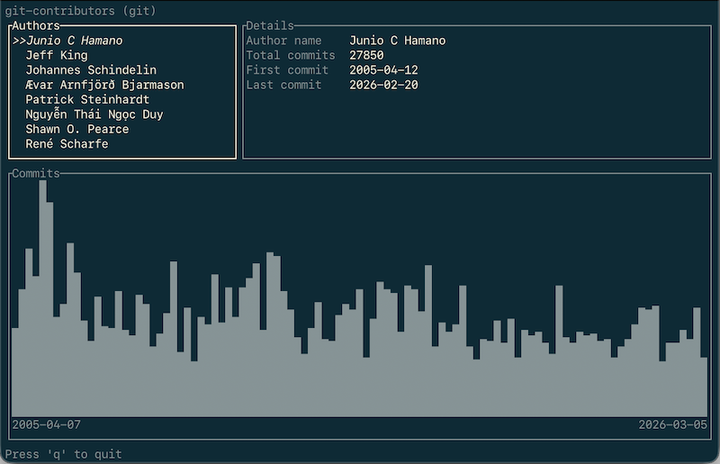

# git-contributors

This is a simple git subcommand to visualize author activity over time as a histogram in the terminal, like the "Contributors" view in GitHub Insights.



## Install

This tool is a git subcommand, which means as long as it is placed somewhere on the user's $PATH, git will automatically pick it up.

Then you can run "git contributors" from within any git repo.

See makefile for details:

```sh
make install
```

## Test

```sh
make test
```
